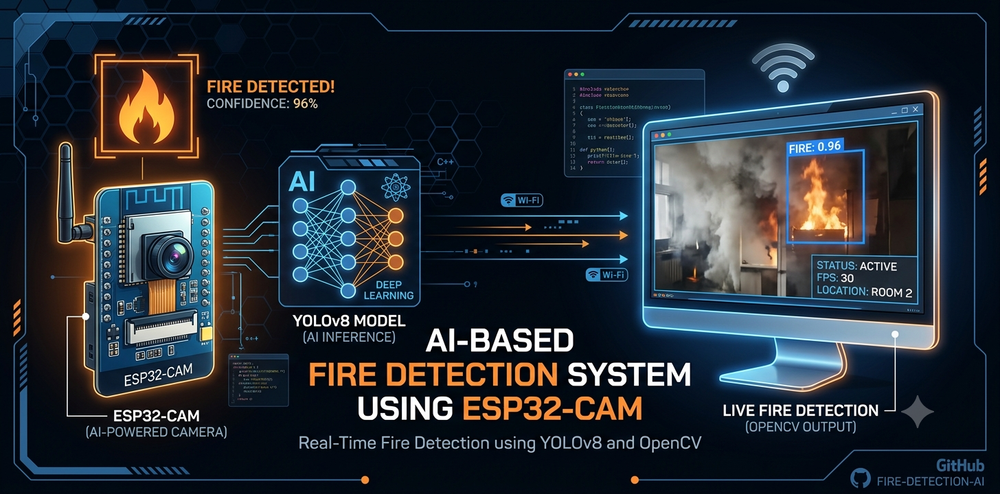

<p align="center">
  
</p>

<h1 align="center">🔥 AI-Based Fire Detection System using ESP32-CAM</h1>

<p align="center">
  
  
  
  
  
</p>

---

# 📖 Project Overview

The **AI-Based Fire Detection System using ESP32-CAM** is an intelligent real-time fire detection solution developed using **ESP32-CAM**, **YOLOv8**, **Python**, and **OpenCV**.

The ESP32-CAM continuously streams live video frames over Wi-Fi to a Python application running on a computer. The application processes each frame using a trained YOLOv8 model to identify fire in real time. When fire is detected, the system displays bounding boxes with confidence scores and can be extended to send alerts through Telegram or other IoT platforms.

This project demonstrates the integration of **Embedded Systems**, **Computer Vision**, and **Artificial Intelligence** for smart fire monitoring applications.

---

# 🚀 Features

- 🔥 Real-Time Fire Detection
- 📷 Live Video Streaming using ESP32-CAM
- 🤖 YOLOv8 Deep Learning Detection
- 🎯 Bounding Box Detection
- 📊 Confidence Score Display
- 💻 Python + OpenCV Processing
- 🌐 Wi-Fi Based Camera Streaming
- ⚡ Low-Cost Embedded AI Solution

---

# 🛠 Hardware Components

- ESP32-CAM (AI Thinker)
- FTDI USB-to-Serial Programmer
- USB Cable
- Jumper Wires
- Breadboard
- Laptop / PC

---

# 💻 Software Requirements

- Arduino IDE
- Python 3.x
- OpenCV
- Ultralytics YOLOv8
- NumPy
- PyTorch
- VS Code

---

# 📂 Project Structure

```text
AI-Based-Fire-Detection-ESP32CAM
│
├── Arduino_Code/
├── Python_Code/
├── Images/
├── Results/
├── Docs/
├── Demo_Video/
│
├── README.md
├── LICENSE
├── .gitignore
└── requirements.txt
```

---

# 🏗 System Architecture

<p align="center">

</p>

---

# 📊 Block Diagram

<p align="center">

</p>

---

# 🔄 Flowchart

<p align="center">

</p>

---

# 🔌 Circuit Diagram

<p align="center">

</p>

---

# 📷 Hardware Setup

<p align="center">

</p>

---

# ⚙ Working Principle

1. ESP32-CAM captures live video.
2. Video is streamed over Wi-Fi.
3. Python receives the live stream.
4. YOLOv8 processes every frame.
5. Fire is detected using the trained model.
6. Bounding boxes and confidence scores are displayed.
7. The system can be extended to send notifications for fire detection.

---

# 🧠 Technologies Used

- ESP32-CAM
- Python
- OpenCV
- YOLOv8 (Ultralytics)
- Embedded Systems
- Computer Vision
- Artificial Intelligence

---

# 📸 Detection Results

<p align="center">

</p>

---

# 📥 Installation

Clone the repository

```bash
git clone https://github.com/YOUR_GITHUB_USERNAME/AI-Based-Fire-Detection-ESP32CAM.git
```

Open the project

```bash
cd AI-Based-Fire-Detection-ESP32CAM
```

Install required packages

```bash
pip install -r requirements.txt
```

Run the project

```bash
python Python_Code/fire.py
```

---

# 📄 Documentation

The project documentation is available in the **Docs** folder.

- Project Report
- Presentation
- Additional Documentation

---

# 📹 Demonstration

The demo video is available in the **Demo_Video** folder.

---

# 🔮 Future Enhancements

- Telegram Alert Notifications
- IoT Dashboard Integration
- Email Alert System
- Smoke Detection
- Cloud Data Logging
- Mobile Application
- Multi-Camera Fire Detection
- Edge AI Optimization

---

# 👨‍💻 Author

**Aswin**

Electronics and Communication Engineering

GitHub: https://github.com/Aswin1617-pro

---

# ⭐ Support

If you found this project useful,

⭐ Star this repository

🍴 Fork this repository

🤝 Contribute to improve the project

---

# 📜 License

This project is licensed under the MIT License.
